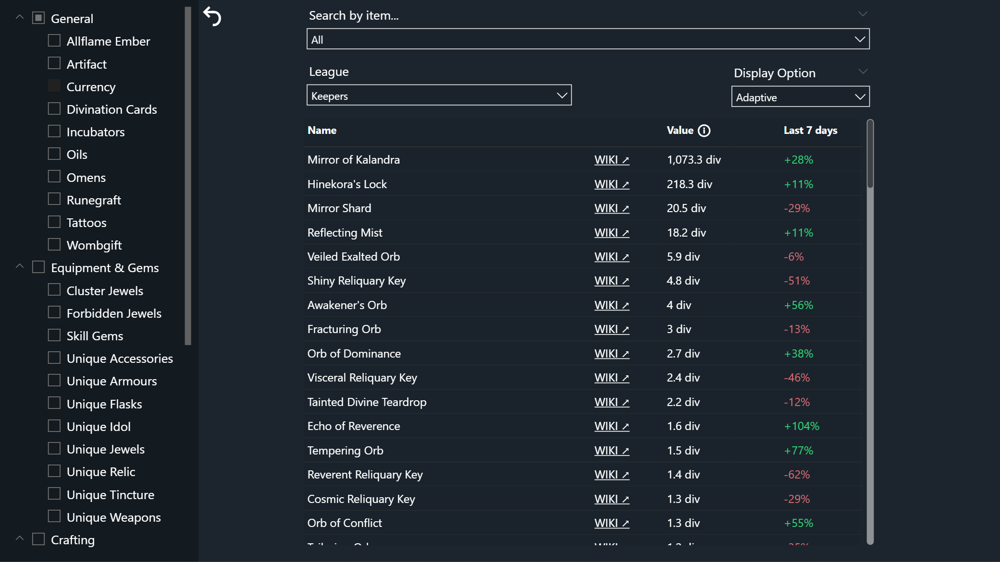
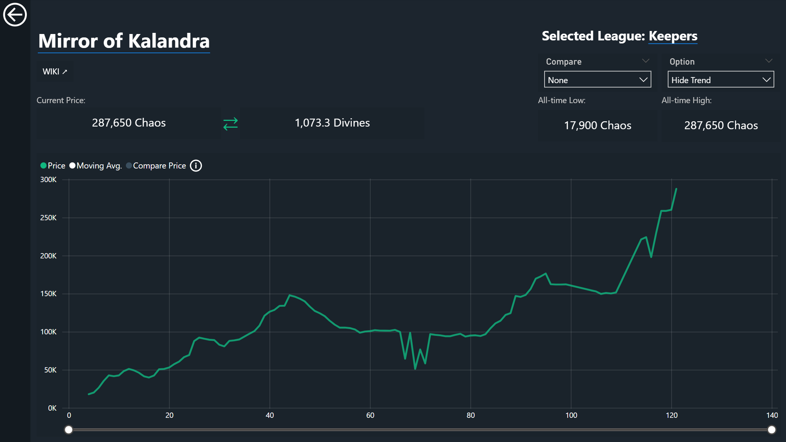

[English Version](#english-version) | [Versão em Português](#versão-em-português)

---

## English Version

# PoE Economy Dashboard

## Project Context
This project consists of the development of an advanced analytical dashboard in Power BI, utilizing PostgreSQL as the backend, for monitoring and analyzing price fluctuations in the Path of Exile game market.

The central objective was to replicate and improve upon the logic of existing community platforms, focusing on solving complex challenges in Data Engineering, dimensional modeling, continuous time intelligence, and the application of advanced business rules via DAX for a corporate-level UI/UX experience and intuitive navigation.

## Technologies Used
* **PostgreSQL:** Backend, Dimensional Modeling (Star Schema), Ingestion via Staging Area, Advanced ETL, Window Functions (Deduplication).
* **Power BI:** Data Modeling, Advanced DAX (Time Intelligence, Complex Filter Contexts, Disconnected Parameters), Dynamic UI/UX.

## Data Engineering and Architecture (PostgreSQL)

### 1. Dimensional Modeling and Performance Optimization
Implementation of a classic Star Schema to support cross-analysis of millions of records between conventional items and currencies.
* **Surrogate Keys:** Textual primary keys were replaced with integer IDs in the Fact and Dimension tables. This action optimized RAM consumption in Power BI's VertiPaq engine and accelerated visual filter processing.
* **Dynamic Calendar:** Creation of a continuous `dCalendar` dimension using the `generate_series()` function, automatically extracting bounds from active dates to ensure autonomous calendar scalability.

### 2. Ingestion Engineering and Sanitization
Development of a robust ingestion flow utilizing the **Staging Area** pattern.
* **Resilience to Schema Drift:** Resolution of a complex granularity issue caused by game API changes using SQL to restructure base name strings directly in the Fact table, separating correct pricing in the dashboard without corrupting historical data.
* **Deduplication via ctid:** Implementation of a data sanitization algorithm using `ROW_NUMBER()` allied with PostgreSQL's internal physical address (`ctid`) to sweep and delete cloned records.

## Advanced Logic in Power BI (DAX and UX)

### 1. Complex Filter Context and Global Currency Anchor
Development of a global currency anchor using `REMOVEFILTERS` to fetch the absolute rate of the "Divine Orb" at the maximum available date, serving as a universal variable for dynamic price conversion.

### 2. Adaptive Display and Reverse Math
Use of `SELECTEDVALUE`, `SWITCH`, and `FORMAT` to adapt price displays. For very low-cost items, the DAX logic automatically inverts the division to display batch yield (e.g., "1 div = 150 units").

### 3. Normalized Time Intelligence
Time normalization performed in PostgreSQL by calculating the physical `league_day` column, allowing for comparative Drill-through charts with a universal X-Axis to visually overlay historical trends from different years.

---

## Versão em Português

# PoE Economy Dashboard

## Contexto do Projeto
Este projeto consiste no desenvolvimento de um dashboard analítico avançado no Power BI, utilizando PostgreSQL como backend, para monitoramento e análise de flutuação de preços no mercado do jogo Path of Exile.

O objetivo central foi replicar e aprimorar a lógica de plataformas existentes na comunidade, focando na resolução de desafios complexos de Engenharia de Dados, modelagem dimensional, integridade de tempo contínua e aplicação de regras de negócio avançadas via DAX para uma experiência de UI/UX de nível corporativo e navegação intuitiva.

## Tecnologias Utilizadas
* **PostgreSQL:** Backend, Modelagem Dimensional (Star Schema), Ingestão via Staging Area, ETL avançado, Window Functions (Deduplicação).
* **Power BI:** Modelagem de Dados, DAX Avançado (Inteligência de Tempo, Contextos de Filtro Complexos, Parâmetros Desconectados), UI/UX Dinâmico.

## Engenharia e Arquitetura de Dados (PostgreSQL)

### 1. Modelagem Dimensional e Otimização de Performance
Implementação de um Star Schema clássico para suportar a análise cruzada de milhões de registros.
* **Surrogate Keys:** Chaves primárias textuais foram substituídas por IDs inteiros otimizando o consumo de RAM no motor VertiPaq do Power BI e acelerando o processamento de filtros visuais.
* **Calendário Dinâmico:** Criação de uma dimensão `dCalendar` contínua utilizando a função `generate_series()`, extraindo limites automaticamente para garantir a escalabilidade autônoma do calendário.

### 2. Engenharia de Ingestão e Sanitização
Desenvolvimento de um fluxo de ingestão robusto utilizando o padrão de **Staging Area**.
* **Resiliência a Schema Drift:** Resolução de um problema complexo de granularidade causado por alterações na API do jogo utilizando SQL para reestruturar strings diretamente na tabela Fato.
* **Deduplicação via ctid:** Implementação de um algoritmo de higienização de dados utilizando a função `ROW_NUMBER()` aliada ao endereço físico interno do PostgreSQL (`ctid`) para deletar registros clonados.

## Lógicas Avançadas no Power BI (DAX e UX)

### 1. Contexto de Filtro Complexo e Âncora de Moeda Global
Desenvolvimento de uma âncora de moeda global utilizando `REMOVEFILTERS` para buscar a cotação absoluta da moeda âncora na data máxima disponível, servindo como variável universal.

### 2. Adaptive Display e Matemática Reversa
Uso de `SELECTEDVALUE`, `SWITCH` e `FORMAT` para adequar a exibição dos preços. Para itens de baixíssimo custo, a lógica DAX inverte a divisão automaticamente para exibir o rendimento do lote (ex: "1 div = 150 units").

### 3. Inteligência de Tempo Normalizada
Normalização temporal no PostgreSQL calculando a coluna física `league_day`, permitindo gráficos comparativos de Drill-through com Eixo X universal para sobreposição visual precisa de tendências históricas.

